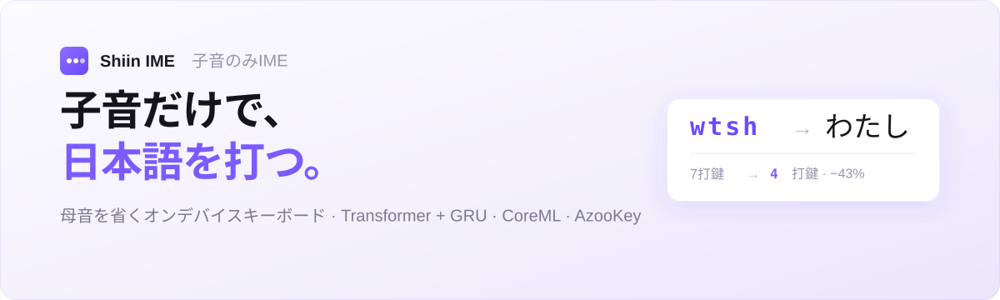

<p align="center">
  
</p>

<p align="center">
  <a href="README.md">English</a> · <b>日本語</b>
</p>

<p align="center">
  <a href="https://huggingface.co/YUGOROU/shiin-ime-gru"></a>
  
  
  
  <a href="LICENSE"></a>
</p>

# Shiin IME ⌨️ — 母音を打たない日本語キーボード

**Shiin IME（子音のみIME）** は、**子音だけ**の入力を日本語に変換する iOS カスタムキーボードです。
母音を省けば打鍵数が減る——軽量なオンデバイスモデルが読みを推定し、
[AzooKey](https://github.com/azooKey/AzooKeyKanaKanjiConverter) が漢字候補に変換します。

> `wtsh` → わたし ・ `ktk` → 帰宅 ・ `gnk` → 元気 — すべての変換は**オンデバイス（CoreML）で完結**し、通信は発生しません。

狙いはシンプルです。日本語の音韻を直感的に把握しているユーザーは、どのみち頭の中で母音を補っている。
ならば母音入力は無駄打ちなので省いてしまえば、打鍵数を約1/3削減できる、という発想です。

## なぜ子音だけなのか

| 入力 | 結果 | 打鍵数 |
|---|---|---|
| `watashi` → `wtsh` | わたし | 7 → **4** |
| `kitaku` → `ktk` | 帰宅（きたく） | 6 → **3** |
| `genki` → `gnk` | 元気（げんき） | 5 → **3** |

モデルは子音の骨格から落ちた母音を復元するよう訓練されており、`a`・`a`・`i` を一度も押さずに
`wtsh` が `わたし` に解決されます。母音キーは残しつつ淡色で無効化され、タップしても無反応です。

## 仕組み — 完全オンデバイスのパイプライン

| 段階 | 処理 |
|---|---|
| ⌨️ **入力** | QWERTY配列で子音をタップ。バッファ（例: `ktk`）が組み上がる。母音タップは除外。 |
| 🧠 **読みモデル** | Transformer Encoder + GRU Decoder の seq2seq（CoreML・約1.3Mパラメータ）が子音列 → ひらがな/カタカナ読み（例: `きたく`）に変換。ビームサーチは Swift 側で実行。 |
| 📖 **かな→漢字** | [AzooKey](https://github.com/azooKey/AzooKeyKanaKanjiConverter) が読みを漢字候補（例: `帰宅`, `機宅`, …）にランク付け変換。 |
| 📝 **確定** | 最有力候補を iOS のマーク済みテキストとしてプレビュー。候補タップまたは `space` で確定。 |

推論はデバウンス（約60ms）され、バックグラウンドスレッドで実行されます（候補バーの更新はメインスレッド）。
全体が**キーボード拡張の厳しい約50MBメモリ制限**に収まり、**通信は一切行いません**——打鍵は端末外に出ません。

## アーキテクチャ

- **読みモデル** — 文字レベルの attention seq2seq。**Transformer Encoder**（3層・d=256・4ヘッド）+
  **GRU Decoder**（2層・hidden 256）に Bahdanau 型 Attention。入力語彙は子音 `a–z` の26文字、
  出力語彙はひらがな+カタカナ（約176記号）。合計 約1.3M パラメータ。
- **CoreML エクスポート** — `encoder.mlpackage`（バッファごとに1回）と `decoder_step.mlpackage`
  （自己回帰1ステップ）に分割、重みは合計 約6MB。固定長・右詰めパディングで `ct.convert()` を安定させ、
  Attention マスクでパディング位置を抑制。
- **オンデバイス専用** — キーボード拡張はネット接続不可かつメモリ上限が厳しいため、モデルは約1.3M
  パラメータに抑え、フォント/画像アセットも同梱しません。
- **かな→漢字は学習せず** AzooKey に委譲し、ニューラルモデルは「子音骨格からの母音復元」という
  本質的に難しい一点に集中させています。

## リポジトリ構成

```
shiin-ime/
├── training/    モデル訓練・前処理・CoreML変換（Python · uv）
│   ├── preprocess.py          jawiki / cc100-ja / livedoor → 子音・読み JSONL
│   ├── preprocess_kakolog.py  KakologArchives → JSONL（口語テキスト）
│   ├── train.py               Transformer+GRU seq2seq 訓練（ストリーミング・AMP・HF連携）
│   ├── coreml_convert.py      チェックポイント → encoder / decoder_step .mlpackage
│   ├── test_model.py          対話的な推論確認
│   └── setup_*.sh             環境セットアップ（前処理 / 訓練 / Vast.ai）
├── ios/         iOSキーボード拡張 + コンテナアプリ（Swift · XcodeGen）
│   ├── project.yml                        XcodeGen プロジェクト（AzooKey SwiftPM 依存）
│   ├── ShiinIMEApp/                       コンテナアプリ（拡張配布に必須）
│   └── ShiinIMEKeyboard/
│       ├── Sources/ShiinInferenceEngine.swift   CoreML encoder/decoder + ビームサーチ
│       ├── Sources/AzooKeyConverter.swift       読み → 漢字候補
│       ├── Sources/KeyboardViewController.swift UIInputViewController + キーUI
│       └── Resources/                           encoder/decoder .mlpackage + vocab.json
└── design/      デザインブリーフ + UIモックアップ（React/JSX プロトタイプ・非同梱）
```

## モデル

| 項目 | 内容 |
|---|---|
| アーキテクチャ | Transformer Encoder + GRU Decoder, attention seq2seq（文字レベル） |
| パラメータ | 約1.3M |
| 推論 | CoreML オンデバイス（`encoder` + `decoder_step`, 合計 約7MB） |
| 入出力 | 子音列（例: `wtsh`）→ 読み（例: `わたし`） |
| 重み | [`YUGOROU/shiin-ime-gru`](https://huggingface.co/YUGOROU/shiin-ime-gru) |

## ビルド

### iOSアプリ

[XcodeGen](https://github.com/yonaskolb/XcodeGen) が必要です（Xcode プロジェクトは生成物でコミットしていません）。

```bash
cd ios
xcodegen generate
open ShiinIME.xcodeproj
```

キーボードは `ShiinIMEApp` コンテナ内の**アプリ拡張**（`com.apple.keyboard-service`）で、iOS 16+ が対象です。
AzooKey は SwiftPM で取得します。端末インストール後、
*設定 → 一般 → キーボード → キーボード* から有効化してください。

### CoreML変換（訓練済みチェックポイントから）

Python スクリプトは [uv](https://github.com/astral-sh/uv) で実行します（インラインスクリプトメタデータ採用・
venv も `requirements.txt` も不要）。

```bash
cd training
uv run coreml_convert.py                       # HFから重みをDL、または:
uv run coreml_convert.py --checkpoint outputs/model_best.pt
```

生成された `encoder.mlpackage` / `decoder_step.mlpackage` / `vocab.json` を
`ios/ShiinIMEKeyboard/Resources/` にコピーします。

## 訓練

読みモデルは、公開日本語コーパスから抽出した「子音↔読み」ペアで訓練します。

```bash
cd training
uv run preprocess.py            # jawiki-paragraphs · cc100-ja · livedoor-news → JSONL
uv run preprocess_kakolog.py    # KakologArchives → JSONL（口語スタイル）
uv run train.py --hf-dataset-repo <dataset> --hf-model-repo shiin-ime-gru
```

`preprocess.py` は [cutlet](https://github.com/polm/cutlet)/fugashi で日本語をローマ字化し、母音を除去して
`{"consonants", "reading", "source", "type"}` 形式（単語と文の両方）を出力します。`train.py` は JSONL を
ストリーミングしつつオンライン受理サンプリングで文/単語比率を維持し、AMP + teacher forcing で訓練、
CER を計測し、任意で [Trackio](https://github.com/gradio-app/trackio) にログを送り、最良チェックポイントを
Hub にアップロードします。

## デザイン

`design/` にはデザインブリーフ（`DESIGN_BRIEF.md`）、ビジュアルデザイン引継ぎ（`README.md`）、
`design_files/` 配下のインタラクティブな React/JSX モックアップ（`index.html` をブラウザで開くとモック
キーボードで入力できます）が含まれます。これらは**参照用**で、本番UIは UIKit でネイティブに再実装します。

## ライセンス・謝辞

- 本リポジトリのコードは [MIT License](LICENSE) で公開しています。
- かな→漢字変換は [AzooKey / AzooKeyKanaKanjiConverter](https://github.com/azooKey/AzooKeyKanaKanjiConverter)
  を利用し、そのアップストリームライセンスに従います。
- 訓練データは公開日本語コーパス——
  [jawiki-paragraphs](https://huggingface.co/datasets/hpprc/jawiki-paragraphs)、
  [cc100-ja](https://huggingface.co/datasets/range3/cc100-ja)、
  [livedoor-news-corpus](https://huggingface.co/datasets/shunk031/livedoor-news-corpus)、
  KakologArchives——から生成しており、各データセットの規約に従います。
