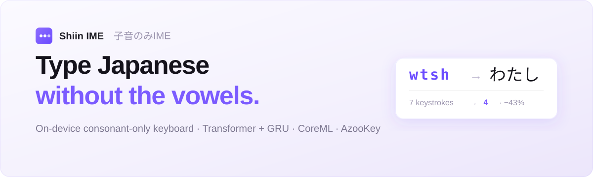

<p align="center">
  
</p>

<p align="center">
  <b>English</b> · <a href="README.ja.md">日本語</a>
</p>

<p align="center">
  <a href="https://huggingface.co/YUGOROU/shiin-ime-gru"></a>
  
  
  
  <a href="LICENSE"></a>
</p>

# Shiin IME ⌨️ — type Japanese without the vowels

**Shiin IME** (子音のみIME, *shiin* = "consonant") is an iOS custom keyboard that turns a **consonant-only**
string into Japanese. Skip the vowels, type fewer keys: a small on-device model guesses the reading and
[AzooKey](https://github.com/azooKey/AzooKeyKanaKanjiConverter) turns it into kanji candidates.

> `wtsh` → わたし · `ktk` → 帰宅 · `gnk` → 元気 — every keystroke runs **fully on-device** (CoreML), no network.

The bet: people who already know Japanese phonetics hold the vowels in their head anyway, so making them
type the vowels is wasted motion. Drop them and you cut keystrokes by roughly a third.

## Why consonants only

| Type this | Get this | Keystrokes |
|---|---|---|
| `watashi` → `wtsh` | わたし | 7 → **4** |
| `kitaku` → `ktk` | 帰宅 (きたく) | 6 → **3** |
| `genki` → `gnk` | 元気 (げんき) | 5 → **3** |

The model is trained to recover the dropped vowels from consonant skeletons, so `wtsh` resolves to `わたし`
without you ever pressing `a`, `a`, `i`. Vowel keys stay on the keyboard but are dimmed and inert — tapping
one is a no-op.

## How it works — a fully on-device pipeline

| Stage | What happens |
|---|---|
| ⌨️ **Input** | User taps consonants on a QWERTY layout; the buffer (e.g. `ktk`) builds up. Vowel taps are filtered out. |
| 🧠 **Reading model** | A Transformer-encoder + GRU-decoder seq2seq (CoreML, ~1.3M params) maps the consonant string → a hiragana/katakana reading (e.g. `きたく`). Beam search runs in Swift. |
| 📖 **Kana → Kanji** | [AzooKey](https://github.com/azooKey/AzooKeyKanaKanjiConverter) converts the reading into ranked kanji candidates (e.g. `帰宅`, `機宅`, …). |
| 📝 **Commit** | The top candidate previews as iOS marked text; tap a candidate or press `space` to commit. |

Inference is debounced (~60 ms) and runs on a background thread; the candidate bar updates on the main
thread. The whole thing fits inside the **strict ~50 MB keyboard-extension memory budget** and makes **no
network requests** — keystrokes never leave the device.

## Architecture

- **Reading model** — character-level attention seq2seq: a **Transformer encoder** (3 layers, d=256, 4
  heads) + a **GRU decoder** (2 layers, hidden 256) with Bahdanau-style attention. Input vocab = 26
  consonants `a–z`; output vocab = hiragana + katakana (~176 symbols). ~1.3M parameters total.
- **CoreML export** — split into `encoder.mlpackage` (runs once per buffer) and `decoder_step.mlpackage`
  (one autoregressive step), ~6 MB of weights combined. Fixed-length, right-padded inputs keep the
  `ct.convert()` step stable; an attention mask suppresses padding positions.
- **On-device only** — the keyboard extension has no internet access and a tight memory ceiling, which is
  why the model stays at ~1.3M params and ships no font/image assets.
- **Kana→kanji** is delegated to AzooKey rather than learned, keeping the neural model focused on the one
  hard part: recovering vowels from consonant skeletons.

## Repository layout

```
shiin-ime/
├── training/    Model training, preprocessing & CoreML conversion (Python · uv)
│   ├── preprocess.py          jawiki / cc100-ja / livedoor → consonant·reading JSONL
│   ├── preprocess_kakolog.py  KakologArchives → JSONL (conversational text)
│   ├── train.py               Transformer+GRU seq2seq training (streaming, AMP, HF up/download)
│   ├── coreml_convert.py      checkpoint → encoder / decoder_step .mlpackage
│   ├── test_model.py          quick interactive inference check
│   └── setup_*.sh             environment bootstrap (preprocess / train / Vast.ai)
├── ios/         iOS keyboard extension + companion app (Swift · XcodeGen)
│   ├── project.yml                        XcodeGen project (AzooKey SwiftPM dependency)
│   ├── ShiinIMEApp/                       container app (required to ship the extension)
│   └── ShiinIMEKeyboard/
│       ├── Sources/ShiinInferenceEngine.swift   CoreML encoder/decoder + beam search
│       ├── Sources/AzooKeyConverter.swift       reading → kanji candidates
│       ├── Sources/KeyboardViewController.swift UIInputViewController + key UI
│       └── Resources/                           encoder/decoder .mlpackage + vocab.json
└── design/      Design brief + UI mockups (React/JSX prototypes, not shipped)
```

## Model

| Item | Detail |
|---|---|
| Architecture | Transformer encoder + GRU decoder, attention seq2seq (character-level) |
| Parameters | ~1.3M |
| Inference | CoreML on-device (`encoder` + `decoder_step`, ~7 MB total) |
| I/O | consonant string (e.g. `wtsh`) → reading (e.g. `わたし`) |
| Weights | [`YUGOROU/shiin-ime-gru`](https://huggingface.co/YUGOROU/shiin-ime-gru) |

## Building

### iOS app

Requires [XcodeGen](https://github.com/yonaskolb/XcodeGen) (the Xcode project is generated, not committed).

```bash
cd ios
xcodegen generate
open ShiinIME.xcodeproj
```

The keyboard is an **app extension** (`com.apple.keyboard-service`) inside the `ShiinIMEApp` container,
targeting iOS 16+. AzooKey is pulled in via SwiftPM. After installing on device, enable it under
*Settings → General → Keyboard → Keyboards*.

### CoreML conversion (from a trained checkpoint)

All Python entry points run with [uv](https://github.com/astral-sh/uv) (inline script metadata — no venv,
no `requirements.txt`):

```bash
cd training
uv run coreml_convert.py                       # downloads weights from HF, or:
uv run coreml_convert.py --checkpoint outputs/model_best.pt
```

Copy the resulting `encoder.mlpackage` / `decoder_step.mlpackage` / `vocab.json` into
`ios/ShiinIMEKeyboard/Resources/`.

## Training

The reading model is trained on consonant↔reading pairs mined from public Japanese corpora.

```bash
cd training
uv run preprocess.py            # jawiki-paragraphs · cc100-ja · livedoor-news → JSONL
uv run preprocess_kakolog.py    # KakologArchives → JSONL (conversational style)
uv run train.py --hf-dataset-repo <dataset> --hf-model-repo shiin-ime-gru
```

`preprocess.py` romanizes Japanese text with [cutlet](https://github.com/polm/cutlet)/fugashi, strips the
vowels, and emits `{"consonants", "reading", "source", "type"}` records (both single words and full
sentences). `train.py` streams the JSONL with an online accept-sampling buffer to hold a target
sentence/word ratio, trains with AMP + teacher forcing, tracks CER, and optionally logs to
[Trackio](https://github.com/gradio-app/trackio) and uploads the best checkpoint to the Hub.

## Design

`design/` contains the design brief (`DESIGN_BRIEF.md`), the visual-design handoff (`README.md`), and
interactive React/JSX mockups under `design_files/` (open `index.html` in a browser to type with the mock
keyboard). These are **references** — the production UI is rebuilt natively in UIKit.

## License & acknowledgements

- Code in this repository is released under the [MIT License](LICENSE).
- Kana→kanji conversion uses [AzooKey / AzooKeyKanaKanjiConverter](https://github.com/azooKey/AzooKeyKanaKanjiConverter)
  and retains its upstream license.
- Training data is derived from public Japanese corpora —
  [jawiki-paragraphs](https://huggingface.co/datasets/hpprc/jawiki-paragraphs),
  [cc100-ja](https://huggingface.co/datasets/range3/cc100-ja),
  [livedoor-news-corpus](https://huggingface.co/datasets/shunk031/livedoor-news-corpus), and
  KakologArchives — each under its own terms.
